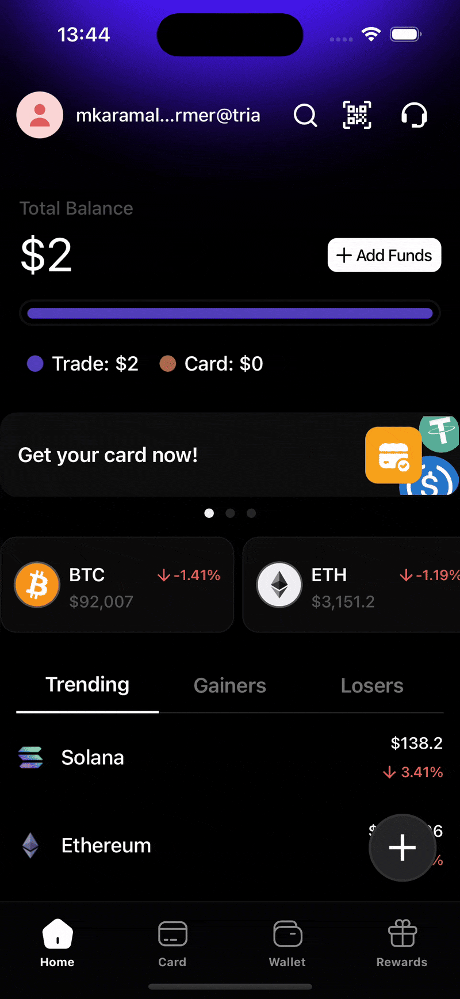

# react-native-tour-pilot 🚀

A flexible, customizable tour/walkthrough library for React Native with **multi-tour support**, **customizable mask shapes**, and **Portal-based rendering**.

<p align="center">
  
  
  
</p>



## Features

- ✅ **Multi-tour support** - Run multiple independent tours in your app
- ✅ **Mask shapes** - Circle, rectangle, or rounded rectangle spotlight masks
- ✅ **Portal-based rendering** - Works seamlessly with bottom sheets and modals
- ✅ **Event system** - Subscribe to tour lifecycle events
- ✅ **Customizable tooltips** - Bring your own tooltip component
- ✅ **TypeScript first** - Full type definitions included
- ✅ **Animated transitions** - Smooth animations between steps
- ✅ **Cross-platform** - Works on iOS and Android

## Installation

```bash
npm install react-native-tour-pilot react-native-svg
# or
yarn add react-native-tour-pilot react-native-svg
```

### Peer Dependency: Portal support

For compatibility with modals and bottom sheets, install `@gorhom/portal`:
Portals are used to create a custom modal component that does not rely on react native Modal.
This proved to be difficult to work with on android and so gorhom portal is used to create a modal overlay rather than utilising the native modal

```bash
npm install @gorhom/portal
# or
yarn add @gorhom/portal
```

## Quick Start

### 1. Wrap your app with TourProvider

```tsx
import { TourProvider } from 'react-native-tour-pilot';

function App() {
  return (
    <TourProvider backdropColor="rgba(0, 0, 0, 0.75)" borderRadius={12}>
      <YourApp />
    </TourProvider>
  );
}
```

### 2. Create walkthroughable components

```tsx
import { View, Pressable } from 'react-native';
import { walkthroughable } from 'react-native-tour-pilot';

const WalkthroughableView = walkthroughable(View);
const WalkthroughablePressable = walkthroughable(Pressable);
```

### 3. Mark elements as tour steps

```tsx
import { TourStep, useTourControl } from 'react-native-tour-pilot';

function HomeScreen() {
  const { start } = useTourControl('onboarding', {
    onStop: (completed) => {
      if (completed) {
        console.log('Tour completed!');
      }
    },
  });

  useEffect(() => {
    // Start tour after a short delay
    setTimeout(() => start(), 500);
  }, []);

  return (
    <View>
      <TourStep
        tourKey="onboarding"
        name="profile"
        order={1}
        text="Welcome||Tap here to access your profile settings"
      >
        <WalkthroughableView style={styles.profileButton}>
          <ProfileIcon />
        </WalkthroughableView>
      </TourStep>

      <TourStep
        tourKey="onboarding"
        name="fab"
        order={2}
        text="Quick Actions||Press this button to create something new"
        maskShape="circle"
      >
        <WalkthroughablePressable style={styles.fab}>
          <PlusIcon />
        </WalkthroughablePressable>
      </TourStep>
    </View>
  );
}
```

## API Reference

### TourProvider

Wrap your app with `TourProvider` to enable tours.

```tsx
<TourProvider
  tooltipComponent={CustomTooltip} // Custom tooltip component
  backdropColor="rgba(0,0,0,0.75)" // Backdrop overlay color
  borderRadius={8} // Default border radius for masks
  arrowSize={8} // Tooltip arrow size
  arrowColor="#fff" // Tooltip arrow color
  animationDuration={400} // Animation duration in ms
  stepNumberComponent={StepBadge} // Custom step number badge
  stopOnOutsideClick={false} // Stop tour when clicking outside
  portalHostName="tour-pilot-portal" // Portal host name
>
  {children}
</TourProvider>
```

### TourStep

Wrap elements you want to highlight.

| Prop           | Type                                             | Default               | Description                                 |
| -------------- | ------------------------------------------------ | --------------------- | ------------------------------------------- |
| `tourKey`      | `string`                                         | Required              | Unique identifier for the tour              |
| `name`         | `string`                                         | Required              | Unique name for this step                   |
| `order`        | `number`                                         | Required              | Order of this step (lower = earlier)        |
| `text`         | `string`                                         | Required              | Tooltip content. Use `Title\|\|Body` format |
| `maskShape`    | `'circle' \| 'rectangle' \| 'rounded-rectangle'` | `'rounded-rectangle'` | Shape of the spotlight mask                 |
| `borderRadius` | `number`                                         | Provider default      | Custom border radius                        |
| `active`       | `boolean`                                        | `true`                | Whether this step is active                 |

### useTourControl

Hook for controlling a specific tour.

```tsx
const {
  start, // (fromStep?: string) => Promise<void>
  stop, // () => Promise<void>
  isActive, // boolean
  currentStep, // Step | undefined
  currentStepNumber, // number
  totalStepsNumber, // number
} = useTourControl('tour-key', {
  onStart: () => {},
  onStop: (completed) => {},
  onStepChange: (step, stepNumber) => {},
  scrollViewRef: ref,
});
```

### useTour

Low-level hook for direct tour context access.

```tsx
const tour = useTour();

// Start a tour
await tour.start('onboarding');

// Navigation
await tour.goToNext();
await tour.goToPrev();
await tour.goToNth(3);

// Stop tour
await tour.stop();

// Subscribe to events
tour.on('start', ({ tourKey }) => {});
tour.on('stop', ({ tourKey, completed }) => {});
tour.on('stepChange', ({ tourKey, step, stepNumber }) => {});
```

### walkthroughable

HOC to make components compatible with tour highlighting.

```tsx
import { View, Text, Pressable, TouchableOpacity } from 'react-native';
import { walkthroughable } from 'react-native-tour-pilot';

const WalkthroughableView = walkthroughable(View);
const WalkthroughableText = walkthroughable(Text);
const WalkthroughablePressable = walkthroughable(Pressable);
```

## Custom Tooltip

Create your own tooltip component:

```tsx
import { TooltipProps } from 'react-native-tour-pilot';

const CustomTooltip: React.FC<TooltipProps> = ({
  currentStep,
  currentStepNumber,
  totalStepsNumber,
  isFirstStep,
  isLastStep,
  goToNext,
  goToPrev,
  stop,
}) => {
  // Parse "Title||Body" format
  const [title, body] = currentStep?.text.split('||') || ['', ''];

  return (
    <View style={styles.tooltip}>
      <Text style={styles.title}>{title}</Text>
      <Text style={styles.body}>{body}</Text>

      <View style={styles.navigation}>
        <Button
          title={isFirstStep ? 'Skip' : 'Back'}
          onPress={isFirstStep ? stop : goToPrev}
        />
        <Text>{currentStepNumber}/{totalStepsNumber}</Text>
        <Button
          title={isLastStep ? 'Done' : 'Next'}
          onPress={isLastStep ? stop : goToNext}
        />
      </View>
    </View>
  );
};

// Use it
<TourProvider tooltipComponent={CustomTooltip}>
```

## Multiple Tours

Run independent tours for different features:

```tsx
function App() {
  const onboarding = useTourControl('onboarding');
  const featureDiscovery = useTourControl('feature-discovery');
  const settingsGuide = useTourControl('settings-guide');

  return (
    <>
      {/* Onboarding tour steps */}
      <TourStep tourKey="onboarding" name="step1" order={1} text="...">
        <WalkthroughableView>...</WalkthroughableView>
      </TourStep>

      {/* Feature discovery tour steps */}
      <TourStep
        tourKey="feature-discovery"
        name="new-feature"
        order={1}
        text="..."
      >
        <WalkthroughableView>...</WalkthroughableView>
      </TourStep>

      {/* Start different tours independently */}
      <Button title="Start Onboarding" onPress={() => onboarding.start()} />
      <Button
        title="Show New Feature"
        onPress={() => featureDiscovery.start()}
      />
    </>
  );
}
```

## Portal Setup (Recommended)

For better compatibility with modals and bottom sheets:

```tsx
import { PortalProvider, PortalHost } from '@gorhom/portal';
import { TourProvider } from 'react-native-tour-pilot';

function App() {
  return (
    <PortalProvider>
      <TourProvider portalHostName="tour-pilot-portal">
        <YourApp />
        <PortalHost name="tour-pilot-portal" />
      </TourProvider>
    </PortalProvider>
  );
}
```

## Mask Shapes

Choose the right mask shape for your UI elements:

```tsx
// Circle - for round buttons, FABs, avatars
<TourStep maskShape="circle" ...>

// Rectangle - for sharp-cornered elements
<TourStep maskShape="rectangle" ...>

// Rounded rectangle (default) - for cards, buttons with border radius
<TourStep maskShape="rounded-rectangle" borderRadius={16} ...>
```

## Event System

Subscribe to tour lifecycle events:

```tsx
const tour = useTour();

useEffect(() => {
  const handleStart = ({ tourKey }) => {
    analytics.track('tour_started', { tour: tourKey });
  };

  const handleStop = ({ tourKey, completed }) => {
    analytics.track('tour_ended', { tour: tourKey, completed });
  };

  const handleStepChange = ({ tourKey, step, stepNumber }) => {
    analytics.track('tour_step', {
      tour: tourKey,
      step: step?.name,
      number: stepNumber,
    });
  };

  tour.on('start', handleStart);
  tour.on('stop', handleStop);
  tour.on('stepChange', handleStepChange);

  return () => {
    tour.off('start', handleStart);
    tour.off('stop', handleStop);
    tour.off('stepChange', handleStepChange);
  };
}, []);
```

## TypeScript

Full TypeScript support included:

```tsx
import type {
  TourKey,
  MaskShape,
  Step,
  TooltipProps,
  TourProviderOptions,
  TourControl,
  UseTourControlOptions,
} from 'react-native-tour-pilot';
```

## Troubleshooting

### Tour doesn't start

Steps need time to register. Add a delay:

```tsx
useEffect(() => {
  setTimeout(() => start(), 300);
}, []);
```

### Tooltip buttons not working on Android

Make sure you're using `Pressable` or `TouchableOpacity` with proper `pointerEvents`:

```tsx
<Animated.View pointerEvents="box-none">
  <View pointerEvents="auto">
    <Pressable onPress={goToNext}>...</Pressable>
  </View>
</Animated.View>
```

### Portal not working

Ensure `PortalProvider` is an ancestor of `TourProvider`:

```tsx
<PortalProvider>
  <TourProvider>...</TourProvider>
</PortalProvider>
```

## Migration from react-native-copilot

| react-native-copilot | react-native-tour-pilot                              |
| -------------------- | ---------------------------------------------------- |
| `CopilotProvider`    | `TourProvider`                                       |
| `CopilotStep`        | `TourStep` (add `tourKey` prop)                      |
| `useCopilot()`       | `useTourControl(tourKey)`                            |
| `walkthroughable()`  | `walkthroughable()`                                  |
| `copilot` prop       | `tourPilot` prop (or `copilot` for backwards compat) |

## License

MIT © Karam Ali

## Contributing

Contributions are welcome! Please read our contributing guidelines first.
